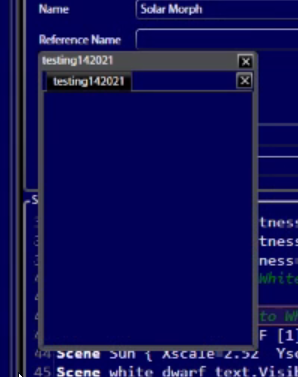

# Create Control Page


Keep in mind that my layout of my workspace will differ from yours, if you do not see a specific window you can reopen it by going to the `Windows` tab \(next to File and Theme\) and then reopening the window you need.


As the definitions page will tell you, a button set is `A collection of similarly related buttons with the ability to organize them using various label buttons or dragging around.`

To create one, you have to go to `Windows > New Control Page` . After you've done so, a little window like this should pop up

Once you have that, you can drag it into your workspace or adjust the size accordingly. To be able to create new buttons/edit existing ones, you have to **unlock** the button set before. To unlock, you can look at the **Widget Toolbox** and press the lock button

Once you have done that, you are ready to start making buttons of your own! Follow the next article to learn how to do so. 

